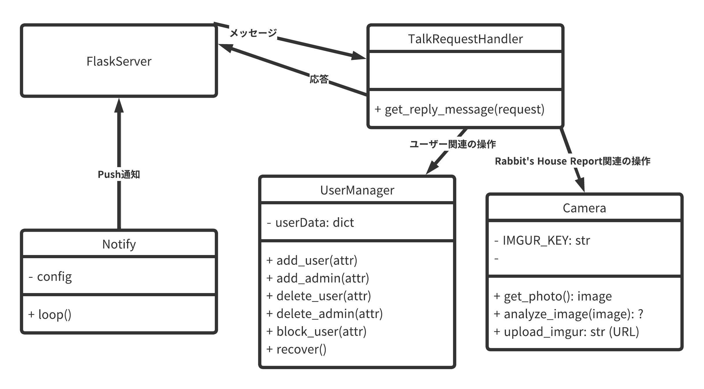

# LINE BOT 箱入り娘 設計図

## TODO
- [X] グローバルでインスタンスを作っておけば大丈夫か検証する  
  → `Handler(time)`
- [ ] LINEからサーバーをシャットダウン出来るようにする

## クラス設計
- HakoitimusumeServer.py  
  flaskが動いているので最終的にはここに集約
- TalkRequestHandler  
  LINEで来たリクエストに対して適切なレスポンスを生成する  
  - Rabbit's House Report
  - メニュー
  - 認証系
  - その他 (ダイアログなど)

- AuthoritiesManager  
  ユーザー・管理者の認証情報を管理する  
  - 初期化 (JSONから読み出し？)
  - ユーザー追加
  - ユーザー削除
  - 合言葉・管理パスワードの管理

- LeaveModeManager  
  外出モードに関する管理をする  
  - 外出モードステータス (Active or Inactive)
  - 通知先 (グループ, Direct Message)
  - 時間管理 (通知間隔)

- TemperatureAlert  
  指定温度を超えたらPush通知を送る
  - 通知温度の設定値
  - 通知先設定値
  - プッシュ通知 (常にバックグラウンドで動作？)

# データベース設計

## User
- id (int) LINEのユーザーID
- type ([-1, 0, 1]) -1:削除済みユーザ, 0:一般ユーザ, 1:特権ユーザ

## NotifyDest
- 